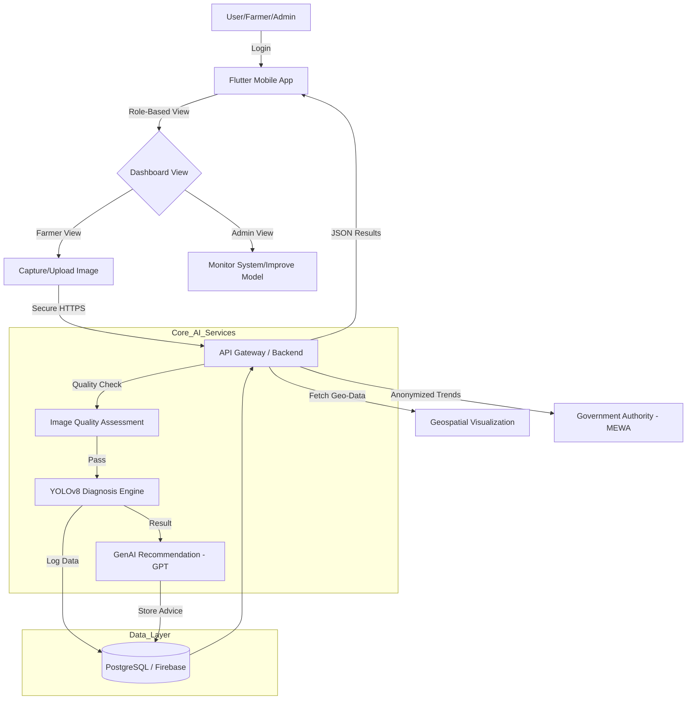

# Project Configuration (LTM)

This file contains the stable, long-term context for the project. It is read at the beginning of sessions and referenced when needed for critical decisions.

## Project Overview

### Project Name

**Muzhir (مزهر)** 

### Project Description

Muzhir is an AI-powered plant disease detection system designed to automate and enhance plant health monitoring in Saudi Arabia. Leveraging Computer Vision, Generative AI, and Cloud Computing, it provides farmers and agricultural stakeholders with accurate, real-time diagnoses, treatment recommendations, and geospatial visualization of disease outbreaks. The project aligns with **Saudi Vision 2030**'s focus on food security and sustainability.

### Key Objectives

* 
**Objective 1:** Design and train a robust computer vision model (YOLOv8) capable of classifying multiple plant diseases under real-world field conditions.


* 
**Objective 2:** Develop a cross-platform mobile application using **Flutter** that allows users to capture images and receive instant diagnostic results and treatment advice.


* 
**Objective 3:** Integrate a Generative AI-based recommendation module (GPT) to translate visual diagnoses into actionable, context-aware management plans.


### Success Criteria

* 
**Criterion 1:** Achieve a classification accuracy of over **90%** on test datasets across various plant species.


* 
**Criterion 2:** System responsiveness targeting an average image diagnosis response time of **under 2 seconds**.


* 
**Criterion 3:** Successful deployment of a scalable cloud-native architecture on **Google Cloud Platform (GCP)** supporting 500+ concurrent requests.


---

## Tech Stack

### Programming Languages

* 
**Python**: 3.x (AI Model development and Backend API logic) 


* 
**Dart**: (Flutter mobile application development) 


* 
**SQL**: (Database management via PostgreSQL) 


### Frameworks & Libraries

* 
**Flutter**: (Mobile UI/UX) 


* 
**FastAPI**: (High-performance RESTful Backend API) 


* 
**PyTorch**: (Deep learning framework for model training) 


* 
**YOLOv8**: (Core object detection architecture) 


* 
**OpenAI GPT API**: (Generative AI for treatment recommendations) 


### Development Environment

* 
**OS**: Windows / macOS / Linux 


* 
**IDE**: Visual Studio Code (VS Code) with Cursor AI 


* 
**Training Environment**: Google Colab / Kaggle Notebooks 


### Deployment Environment

* 
**Cloud Platform**: **Google Cloud Platform (GCP)** 


* 
**Database**: Firebase (Auth/Realtime) & PostgreSQL 


* **CI/CD Pipeline**: Google Cloud Build / GitHub Actions
* 
**Infrastructure Requirements**: Scalable cloud-native instances with GPU support for inference optimization.


---

## Architecture & Design

### System Architecture

Muzhir follows a cloud-native architecture. The mobile frontend interacts with a central API Gateway, which routes requests to specialized modules for image quality assessment, AI inference (YOLOv8), and recommendation generation (GPT) .



### Data Model

* **User/Role**: Manages authentication and permissions. Users and Admins enter through the same login, but the interface adapts based on the role .


* 
**ImageUpload**: Stores image metadata, GPS coordinates, crop type, and growth stage .


* 
**Diagnosis**: Records YOLOv8 output (disease name, confidence score, bounding boxes).


* 
**Recommendation**: Stores GPT-generated treatment plans linked to specific diagnoses.


* 
**ActivityLog**: Tracks all user interactions for auditing and system health monitoring .


### API Design

* 
**Type**: RESTful API returning JSON payloads.


* **Endpoints**:
* 
`/api/login`: User/Admin authentication.


* 
`/api/upload`: Secure image submission.


* 
`/api/diagnosis/{id}`: Retrieves specific detection results.


* 
`/api/recommendation/{id}`: Fetches AI-generated treatment advice.


* 
**Security**: HTTPS, JWT-based authentication, and **Role-Based Access Control (RBAC)**.


---

## Standards & Conventions

### Coding Standards

* 
**Dart/Flutter**: Follow official Flutter style guide (Material 3).


* 
**Python**: Adherence to PEP 8 standards.


* 
**Error Handling**: Standardized HTTP status codes; clear user guidance for poor image quality.


### Naming Conventions

* **Variables/Functions**: camelCase (Dart); snake_case (Python).
* **Classes**: PascalCase for both.

### Design & UI

#### Colors Theme

This color palette is specifically tailored for the Muzhir brand, capturing the essence of nature meeting technology. It utilizes the deep, sophisticated darks from the camera frame element and the vibrant, progressive greens found in the central leaf.

##### Primary Brand Colors

The core colors that define the visual identity.

**1. Midnight Tech Green**

* **Hex Code**: #012623
* **Description**: Deep teal-black representing digital hardware; sophisticated and modern.
* **Usage**: Main headers, navigation bars, and footer backgrounds.

**2. Core Leaf Green**

* **Hex Code**: #308C36
* **Description**: Strong natural green representing the heart of plant life, growth, and vitality.
* **Usage**: Primary action color for CTA buttons, links, and active UI elements.

##### Secondary & Accent Colors

Lighter shades to create depth, gradients, and highlights.

**3. Vivid Sprout**

* **Hex Code**: #81BF54
* **Description**: Bright, energetic green bridging dark and light tones; adds vibrancy.
* **Usage**: Secondary buttons, icons, success messages, and hover states.

**4. Luminous Lime**

* **Hex Code**: #B6D96C
* **Description**: Lightest green representing new growth and sunlight; open and approachable.
* **Usage**: Highlights, badges, background accents, and specific data points.

##### Neutral Colors

Essential for structure and readability.

**5. Deep Charcoal**

* **Hex Code**: #0D0D0D
* **Description**: Classic near-black shade providing high contrast without the harshness of pure black.
* **Usage**: Body text on light backgrounds and borders.

---

## Project Structure

### Directory Organization

```text
muzhir-root/
├── mobile_app/           # Flutter source code
│   ├── lib/              # Providers, Screens (Farmer/Admin), Widgets
│   ├── assets/           # Logos, icons
├── backend/              # FastAPI source code
│   ├── app/              # Routes, Models, Schemas
│   ├── core/             # YOLOv8 & GPT Integration logic
├── ai_models/            # Trained weights and preprocessing scripts
├── docs/                 # Requirements & Design Docs
└── config/               # GCP & API configuration

```

---

## Constraints & Considerations

### Performance & Security

* 
**Latency**: Target average response time **< 2 seconds**.


* 
**Availability**: **≥ 99% uptime**.


* 
**Data Integrity**: Verified checksum validation for each upload.


### Compatibility & Offline

* 
**Device**: Support for Android and iOS.


* 
**Offline Mode**: Local queueing of images with **Auto-Sync** upon connection restoration .


### Tokenization Settings

* **Model context window**: 128,000 tokens (Cursor AI Agent)
* **Strategy**: Prioritize this `project_config.md` and active source files. Use `src/` modularity to manage context size.

---

**Notes on Preferences:**

* **GCP First**: Prioritize Google Cloud Build and Cloud Run for deployment.
* **Unified Entry**: Ensure the `Auth` module redirects to either the `FarmerDashboard` or `AdminDashboard` based on the user object's `role` property.
* **Response Time**: Maintain the 2-second goal in the architecture but prioritize accuracy if a trade-off is required during model quantization.
